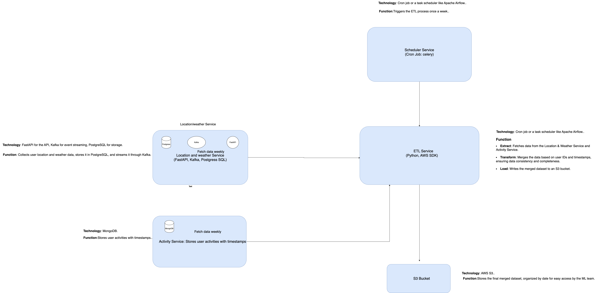

## A detailed and robust system design for generating a weekly dataset for the ML team. 
This design will include the following components:

1. **Location & Weather Service**: Collects and stores user location and weather data.
2. **Activity Service**: Uses MongoDB to store user activities with timestamps.
3. **ETL Service**: Extracts, transforms, and loads data from the Location & Weather Service and Activity Service, merges them, and writes the merged dataset to S3.
4. **Scheduler Service**: Triggers the ETL process once a week.
5. **Data Storage:** An S3 bucket where the merged dataset is stored.

## Detailed Steps

### 1. Data Export:

**Location & Weather Service:**
* Implement an endpoint to export data.
* Use Kafka to stream data updates.

### 2. Activity Service:
Implement an endpoint to export data from MongoDB.

### 3. Scheduler Service
Set up a cron job or use Apache Airflow to trigger the ETL service once a week.

### 4. ETL Process:

Extract:
* Fetch location and weather data from PostgreSQL.
* Fetch activity data from MongoDB.

Transform:
* Match activity data with corresponding location and weather data based on user IDs and timestamps.
* Clean and prepare the data for ML training.

Load:
* Write the merged dataset to S3, ensuring it is organized and accessible.

### 5. S3 Bucket:

Organize data by date (e.g., /datasets/YYYY-MM-DD/merged_data.csv).

